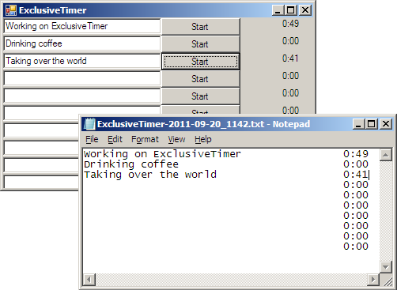

ExclusiveTimer
==============

ExclusiveTimer is a Windows .NET application which helps to keep track on how much time you spent on each project. 

Usage
-----

The ExclusiveTimer window has several lines of textboxes and buttons. Type the project description in the textbox and click the corresponding start button to start the stopwatch.

ExclusiveTimer puts an icon in the system tray. Click on it to bring the window to the front.

Export
------

While ExclusiveTimer is running, it writes the current descriptions and times to a file in D:\Logs.

Screenshot
----------

Author
------

Sjoerd Langkemper, while working at [80dB][80dB]

[80dB]: http://www.80db.nl/
